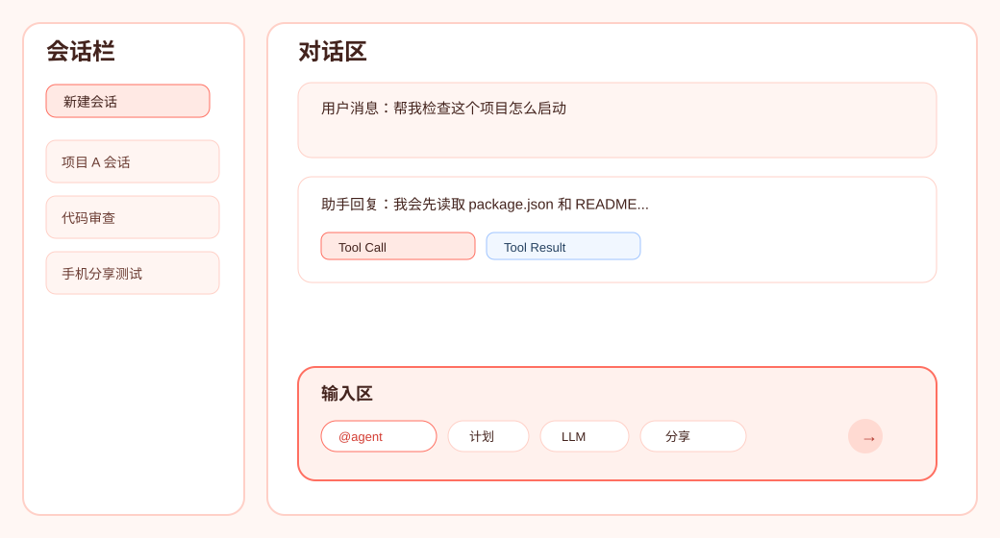
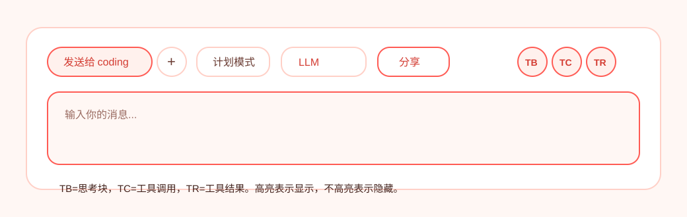
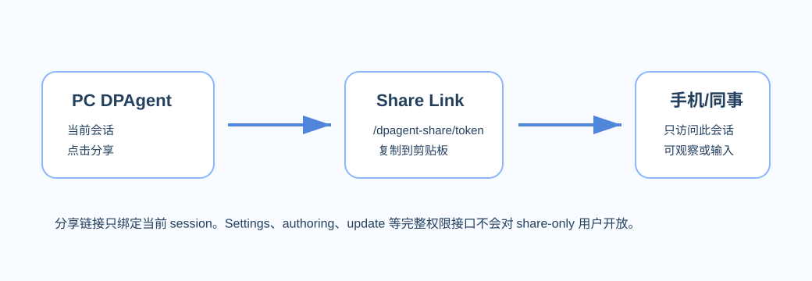
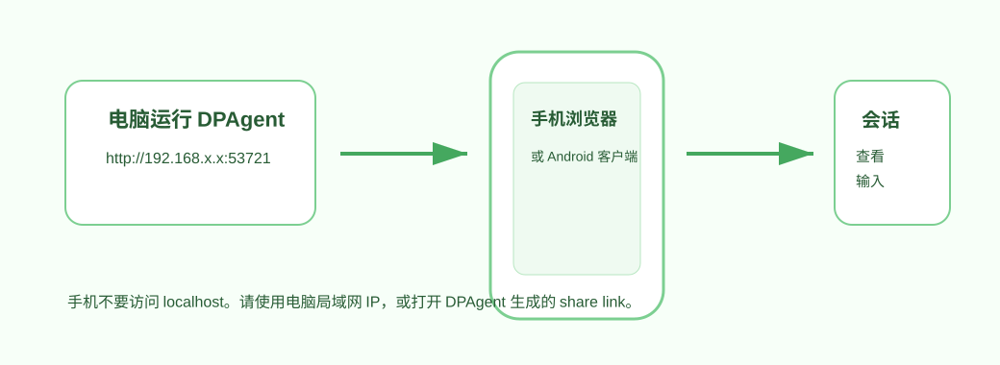
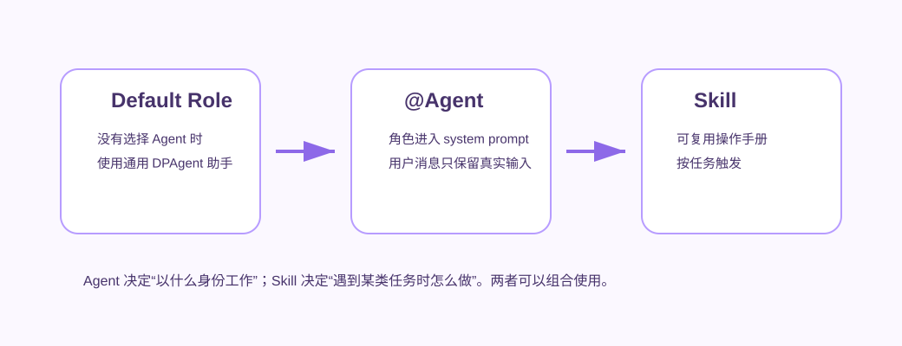
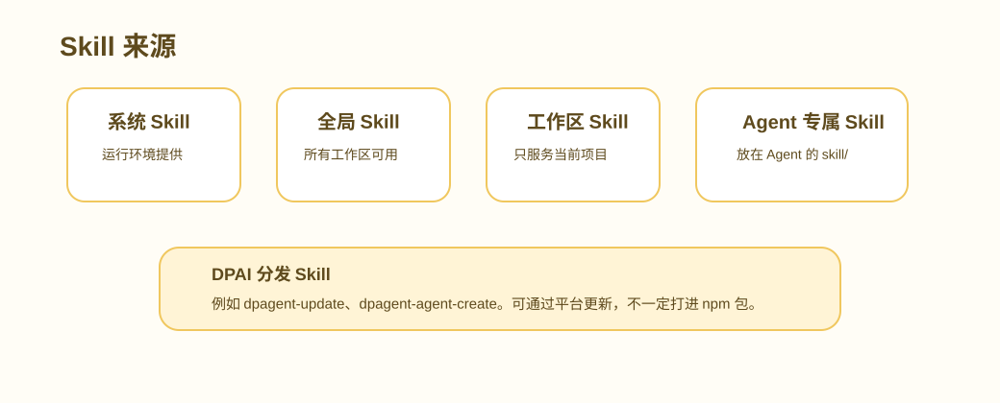

# DPAgent 用户指南

DPAgent 是一个可以在本机或内网运行的 AI Agent 工作台。你可以把它理解成一个“会使用工具的聊天助手”：它能读写工作区文件、运行命令、调用 MCP 工具、记住会话上下文、按计划继续执行，也可以通过分享链接让手机或另一台电脑一起查看和输入。

这份指南写给普通使用者，不要求你了解内部代码结构。

## 适合用来做什么

DPAgent 适合处理这些事情：

- 让 AI 帮你改代码、查日志、整理文档、运行测试。
- 让 AI 先写计划，再按计划一步步执行。
- 在一个长会话里持续工作，不丢上下文。
- 在 PC 上运行 DPAgent，在手机上查看或继续输入。
- 把当前会话分享给同事、手机或另一个 AI 客户端。
- 创建专门的 Agent，例如“小说家”“代码审查员”“测试工程师”。
- 把常用流程做成 Skill，让 Agent 以后可以自动调用。

DPAgent 不适合当成完全开放的公网远程执行服务。它可以读写文件和运行命令，所以远程访问、分享链接和工具权限都应该只给可信的人使用。

## 快速开始

### 安装并启动

如果你已经通过 npm 安装：

```powershell
npm i -g @dpvr/dpagent --registry http://10.100.1.10:4873
npx dpagent
```

如果你从源码运行：

```powershell
npm install
npm run build:web
npm run start:web
```

开发调试时可以使用：

```powershell
npm run dev:web
```

第一次启动时，DPAgent 会在当前目录创建 `config.yaml`。你也可以只初始化配置：

```powershell
npx dpagent init
```

启动后，浏览器打开控制台输出的地址，通常类似：

```text
http://localhost:53721
```

如果要让手机访问，需要使用电脑的局域网地址，例如：

```text
http://192.168.x.x:53721
```

### 第一次必须配置什么

进入 Web 页面后，先打开设置，完成最基本的配置：

1. 配置 LLM Provider：API Key、模型、API Base。
2. 选择工作区：Agent 读写文件和运行命令的默认目录。
3. 如需远程访问，设置访问密码。
4. 如需外部 Agent，设置 `globalAgentsDir`。

没有 API Key 时，页面可以打开，但 Agent 不能真正开始对话。

## 主界面



主界面分成四块：

- 左侧会话栏：创建、切换、固定、删除会话。
- 中间对话区：显示用户消息、助手回复、思考、工具调用、工具结果。
- 底部输入区：输入消息，选择 Agent、文件、计划模式、模型、分享、显示过滤。
- 右侧/设置入口：管理模型、Agent、Skill、自动化、权限和治理。

### 会话是什么

一个会话就是一次连续工作记录。DPAgent 会保存这个会话里的用户输入、助手回复、工具调用、文件结果、上下文压缩记录和恢复信息。

建议这样使用：

- 一个独立任务开一个新会话。
- 同一个功能的多轮修改放在同一个会话里。
- 不同项目尽量使用不同会话和不同工作区。

一个会话同一时间只能有一轮 Agent 在运行。不同会话可以同时运行。

## 输入区怎么用



输入区是日常使用最频繁的地方。

### 发送普通消息

在输入框里直接写需求，然后点击发送按钮。

例子：

```text
帮我看一下这个项目的启动方式，并告诉我应该先跑哪些测试。
```

如果 Agent 需要读文件、运行命令或调用工具，它会自动使用可用工具。你不需要把工具名写出来。

### 选择 Agent

输入 `@` 会弹出可用 Agent 列表。选中后，输入区左侧会出现“发送给 xxx”的标签。

例子：

```text
@novelist 帮我把这一段写成更有画面感的小说风格。
```

选中 Agent 后：

- 本轮消息会使用该 Agent 的角色设定。
- 输入到模型的用户消息不再包含 `@agent` 本身。
- Agent 的角色会作为 system prompt 的 `Active Agent Role` 段注入。
- 如果你点击标签上的 `x` 取消 Agent，下一轮会回到默认 DPAgent 助手身份。

外部 Agent 默认可以被 `@agent` 使用。是否能作为 subagent 使用，由它自己的 `agent.yaml` 决定。

### 添加文件

可以用三种方式给 Agent 文件：

- 点击 `+`，从本机选择文件或目录。
- 把文件拖到输入框。
- 手动输入文件路径。

浏览器通常不能稳定提供本机绝对路径。DPAgent 的处理方式是：如果拖拽拿不到原始路径，就把文件上传到服务端临时目录，然后把服务端可读路径插入消息。这样 Agent 仍然可以读取文件内容。

### Plan Mode

点击“计划模式”后，下一条消息会被当成“先规划”的请求。

适合这些场景：

- 需求比较大，直接执行容易跑偏。
- 你希望先确认改动边界。
- 需要先拆任务，再逐步完成。

Plan Mode 的典型流程：

1. 你打开计划模式并发送需求。
2. Agent 先分析需求，必要时问你问题。
3. Agent 给出计划。
4. 你确认后，Agent 才开始执行。
5. 执行阶段会被 Todo 状态约束，避免没有完成就声称完成。

### LLM 和推理档位

输入区可以选择本会话使用的 LLM Profile、模型和推理档位。

常见档位：

- `off`：不启用额外推理。
- `low`：轻量推理。
- `medium`：默认平衡。
- `high`：更认真，但更慢。
- `xhigh`：OpenAI 高推理档位。
- `max`：Anthropic/Kimi 兼容高推理档位。

不同 provider 支持的档位不同。如果模型不支持某个档位，运行时会按 provider 能力处理或报错。

### TB / TC / TR 显示过滤

输入区右侧有三个显示按钮：

- `TB`：Thinking Block，显示或隐藏思考块。
- `TC`：Tool Call，显示或隐藏工具调用块。
- `TR`：Tool Result，显示或隐藏工具结果块。

按钮高亮表示“显示”，不高亮表示“隐藏”。这只是前端显示过滤，不会删除历史，也不会影响 Agent 的上下文。

## 对话区怎么看

对话区会显示多种内容：

- 文本回复：Agent 给你的自然语言结果。
- Thinking：模型推理或思考过程，可能很长。
- Tool Call：Agent 调用了什么工具，例如读文件、运行命令、调用 MCP。
- Tool Result：工具返回了什么结果。
- Error / Recovery：运行失败、中断、上下文溢出或可恢复检查点。
- Plan / Todo：计划审批和执行进度。

如果你觉得页面太长，可以关闭 TB、TC、TR，只看最终回复。

消息旁边的时间使用服务端记录的真实发生时间，不是浏览器收到消息的时间。

## 工作区

工作区是 Agent 默认读写文件的地方。

建议：

- 改代码时，把工作区设为项目根目录。
- 做资料整理时，把工作区设为资料所在目录。
- 不要把工作区设到太大的系统目录，例如整个系统盘根目录。

工作区里的 `AGENTS.md` 是“工作区说明”，用于告诉 Agent 当前项目规则，例如测试命令、提交规范、目录约束。它不是角色设定，不会把 Agent 变成另一个身份。

## 会话 Fork 和 Arena

### Fork 会话

Fork 会把当前会话的已提交上下文复制成一个新会话。默认名称是在原名称后加 `-fork`，例如 `aaa` 会变成 `aaa-fork`，之后可以继续改名。

适合：

- 从同一段历史开始尝试另一种方向。
- 保留原会话不动，在副本里继续实验。
- 把一个长上下文拆成多个后续任务。

Fork 不会自动发送消息，也不会复制正在运行、中断、待输入或临时状态。源会话需要处于稳定状态。

### Arena

Arena 会从当前会话创建多个公平分支，让最多 4 个选手在同一上下文和独立工作区里处理同一个 prompt。选手可以使用不同 Agent、LLM Profile、模型和推理档位。

进入 Arena 后，源会话会被锁定，主面板切换成 Arena 面板。你可以查看每个选手的日志、提交结果、Judge 建议和 Proposal；也可以通过“原会话”入口只读查看源会话历史。

典型流程：

1. 点击 Fork 右侧的 Arena。
2. 选择选手和 Judge 配置。
3. Start 后所有分支并发执行。
4. 选手提交后，可以运行 Judge，也可以手动选择 winner。
5. 有文件改动时，先生成 Proposal，再二次确认 Apply。

Apply 只会把 winner 分支的提案改动合入源工作区。其他选手的改动不会自动合入。Arena 结束或 Apply 后，源会话解除锁定。

## 分享链接



点击输入区的“分享”按钮，可以为当前会话生成分享链接。

分享链接适合：

- 用手机继续看当前会话。
- 发给同事观察同一个会话。
- 让另一个 AI 客户端通过文本协议访问这个会话。

复制成功后，页面会给出提示。

### 分享链接能做什么

分享链接绑定一个会话，只能访问这个会话。

分享用户可以：

- 查看当前会话历史。
- 在允许控制时发送消息。
- 使用 `@agent` 候选列表。
- 接收运行中的文本、工具进度和完成状态。

分享用户不能：

- 打开全局设置。
- 修改 provider、Agent 配置、Skill 配置。
- 使用新增的 authoring/update API。
- 上传拖拽文件到任意会话。
- 访问其他会话。

### 多个前端同时打开时谁能输入

如果是通过密码登录的完整远程访问，默认认为都是你本人，控制权相同。

如果是 share link：

- 当前正在控制运行的一端拥有本轮控制权。
- 其他分享端可以观察。
- 如果会话正在运行，非控制端会进入观察或忙碌状态。

### 为什么分享链接有时会慢

如果你的电脑开了代理软件，浏览器请求头里的 Host 可能被代理地址污染。DPAgent 生成分享链接时会尽量选择真实局域网 IP，而不是代理节点地址。

如果分享链接在手机上很慢，优先检查：

1. 手机和电脑是否在同一个局域网。
2. 分享链接里是否是电脑的局域网 IP，例如 `192.168.x.x`。
3. 电脑防火墙是否允许 `53721` 端口。
4. 是否开启了会影响局域网访问的代理规则。

## 手机端怎么用



手机有两种使用方式。

### 方式一：手机浏览器打开

1. 确认手机和电脑在同一个 Wi-Fi。
2. 在电脑上启动 DPAgent。
3. 找到电脑局域网 IP，例如 `192.168.x.x`。
4. 手机浏览器打开：

```text
http://192.168.x.x:53721
```

如果配置了远程访问密码，手机会先进入登录页。

### 方式二：Android 客户端打开

Android 客户端是一个 DPAgent WebView 外壳。它适合经常用手机访问 DPAgent 的场景。

它支持：

- 保存多个 DPAgent 电脑端地址。
- 自动给普通地址补 `http://`。
- 从剪贴板添加 `/dpagent-share/<token>` 分享链接。
- 通过 Android 分享菜单接收 DPAgent share link。
- 用系统浏览器打开 DPAgent link 时直接唤起客户端。
- 分享链接过期、撤销或无权限时自动从列表移除。

使用步骤：

1. 打开 Android 客户端。
2. 添加电脑地址，例如 `192.168.x.x:53721`。
3. 点击“打开”进入 DPAgent Web 页面。
4. 如果收到分享链接，可以复制后在客户端添加，或从系统分享菜单打开。

手机端布局会把部分按钮换行显示。常用操作仍然在输入区附近：选择 Agent、添加文件、计划模式、模型、分享、TB/TC/TR、Ralph。

## Agent 是什么



Agent 是“角色 + 偏好配置”。例如：

- 默认 DPAgent 助手：通用开发和操作助手。
- 小说家 Agent：更适合创作文本。
- 审查 Agent：更适合找风险和问题。
- 测试 Agent：更适合写测试和复现步骤。

### 内置 Agent

内置 Agent 随 DPAgent 包发布，默认可用。它们不能在 Agents 配置页编辑，避免升级时被用户配置覆盖。

### 外部 Agent

外部 Agent 是用户自己创建的 Agent，放在：

```text
globalAgentsDir/<AgentName>/AGENTS.md
```

可选配置文件：

```text
globalAgentsDir/<AgentName>/agent.yaml
```

例子：

```yaml
version: 1
description: 小说创作助手
llmProfileId: profile-2-koquc5
llmModel: MiniMax-M2.7-highspeed
reasoningPreset: high
loadGlobalSkills: true
exposeAsSubagent: false
promptAppend: |
  回答时保持自然叙事，不要写成技术报告。
```

常用字段：

- `description`：Agent 说明，会显示在列表里。
- `llmProfileId`：这个 Agent 默认使用哪个 LLM Profile。
- `llmModel`：这个 Agent 默认使用哪个模型。
- `reasoningPreset`：推理档位。
- `loadGlobalSkills`：是否加载全局技能。
- `exposeAsSubagent`：是否出现在 subagent manager。
- `promptAppend`：追加给 Agent 的补充提示。

外部 Agent 默认可以通过 `@agent` 使用。未设置 `exposeAsSubagent: true` 时，不会出现在 `subagent_manage(action=list_agents)` 里。

## Subagent 是什么

Subagent 是 Agent 在执行过程中创建的“子任务执行者”。它适合把一个大任务拆给多个专门角色并行处理。

普通用户可以先理解为：

- `@agent` 是你手动指定本轮用哪个 Agent。
- subagent 是 Agent 自己在任务中创建的子任务。
- 外部 Agent 只有开启 `exposeAsSubagent: true`，才会被主 Agent 当成可创建的 subagent。

## Skill 是什么



Skill 是一份可复用的工作说明和工具封装。Agent 看到合适的任务时，会按 Skill 的说明执行。

可以把 Skill 理解为“给 Agent 的操作手册”。

### Skill 的几种来源

- 内置系统 Skill：随 DPAgent 或运行环境提供。
- 全局 Skill：对所有工作区可见，适合通用流程。
- 工作区 Skill：只对当前项目可见，适合项目内规则。
- Agent 专属 Skill：放在外部 Agent 的 `skill/` 目录下，只服务这个 Agent。
- DPAI 分发 Skill：通过 DPAI 平台下载或更新，不一定打进 npm 包。

### 最近新增的 DPAgent Skill

#### `dpagent-update`

用途：让正在运行的 DPAgent 自己升级。

它会做这些事：

1. 通过运行时 API 识别当前 DPAgent 的版本、进程、安装路径和启动方式。
2. 下载或安装 npm 上的最新 DPAgent 包。
3. 请求当前服务优雅关闭。
4. 重启 DPAgent。
5. 验证新服务和 Web 前端可以打开。

适合用户说：

```text
帮我把当前 DPAgent 升级到最新版本。
```

注意：

- 只对本机或完整远程登录可用。
- share link 用户不能调用。
- source checkout 默认不做危险自升级，除非测试环境显式允许。

#### `dpagent-agent-create`

用途：帮助用户创建或更新外部 Agent。

它会做这些事：

1. 查询当前服务器支持的 Agent 配置格式。
2. 查询可用模型、LLM Profile、MCP、toolset 和工具能力。
3. 根据用户描述生成 `AGENTS.md`。
4. 生成或更新 `agent.yaml`。
5. 写入 `globalAgentsDir/<AgentName>/`。
6. 可选择 dry-run，先预览不落盘。

适合用户说：

```text
帮我创建一个小说家 Agent，默认用 MiniMax，高推理，不作为 subagent。
```

#### `dpagent-share-client`

用途：让另一个 AI 客户端通过 DPAgent 分享链接加入会话。

它可以：

- 读取 share link 的文本历史。
- 发送一条文本问题。
- 下载 Agent 返回的文件链接。

适合自动化或外部 AI 对接，不是普通浏览器用户必须使用的功能。

#### `dpagent-asr-setup`

用途：配置本地语音识别，让 Web 输入区支持语音转文字。

适合用户说：

```text
帮我启用 DPAgent 的语音输入。
```

#### `dpagent-hook-build`

用途：创建 DPAgent hook，在 Agent 执行关键节点做审计、拦截或日志记录。

常见用法：

- 记录每次发给 LLM 的消息摘要。
- 阻止危险 shell 命令。
- 统计工具调用。
- 做企业内部审计。

## 自动化和 Ralph

Ralph 是一种自动循环能力。打开后，Agent 可以在一轮完成后判断是否还有有意义的后续工作，并继续下一轮。

适合：

- 长任务拆分执行。
- 持续修复测试失败。
- 按 Todo 列表逐步推进。

不适合：

- 需求还没说清楚。
- 可能大量修改文件但没人审核。
- API Key 成本敏感。

自动化中心用于创建定时任务。自动化任务可以选择默认 Agent 或外部 Agent。选择外部 Agent 后，自动化的 skill checklist 不再作为主要约束，而是使用该 Agent 自己的规则。

## 记忆、治理和 Skill 审批

DPAgent 可以把稳定事实整理成 memory，也可以把重复流程生成 Skill 草稿。

重要规则：

- memory 保存稳定事实，不保存一整段聊天记录。
- 自动生成的 Skill 默认是草稿，需要审批后才会成为正式 Skill。
- 工作区 Skill 治理只扫描当前工作区，不会跨项目乱改。
- Agent 专属 Skill、全局 Skill、工作区 Skill 是不同来源，不要混在一起理解。

## 常见问题

### 页面能打开，但 Agent 不能回复

检查：

- API Key 是否配置。
- 当前 LLM Profile 是否启用。
- 模型名是否正确。
- provider 的 API Base 是否正确。

### 手机打不开电脑上的 DPAgent

检查：

- 手机和电脑是否在同一个 Wi-Fi。
- 手机访问的是电脑局域网 IP，不是 `localhost`。
- Windows 防火墙是否允许端口。
- 电脑是否正在运行 DPAgent。

### 分享链接复制后别人打不开

检查：

- 分享链接是否过期或被撤销。
- 链接里的 IP 是否是电脑局域网 IP。
- 电脑是否开了代理导致链接变成不可访问地址。
- 对方是否和你在同一个网络。

### 选了 Agent 但回答不像那个 Agent

优先检查：

- 输入区是否还有“发送给 xxx”的标签。
- 是否在运行中追加输入，旧版本可能没有保留 queued input 的 selected Agent。
- 外部 Agent 的 `AGENTS.md` 内容是否真的写了角色要求。
- 是否点击了标签上的 `x` 取消 Agent。

### 对话很长，切换小上下文模型后没反应

长上下文切换到小窗口模型时，DPAgent 可能需要预压缩历史。建议：

- 等待压缩状态完成。
- 尽量在新会话中使用小窗口模型。
- 如果已经有几十万 token 的上下文，先让 Agent 总结当前状态，再开新会话继续。

### 拖拽文件后路径不是原始路径

这是浏览器限制。DPAgent 会把文件上传到服务端临时目录，再插入服务端路径。Agent 仍然可以读取该文件。

### 会话显示正在运行，但其实没有动静

可以先刷新页面。若刷新后恢复，通常是前端本地状态变旧。若频繁出现，应导出日志并检查：

- active run 状态。
- WebSocket 是否断开。
- 后端 `logs/webserver.log`。
- 当前 session 的 `contexts/session/<id>/meta.json`。

## 推荐使用习惯

- 每个任务单独开会话。
- 大任务先用 Plan Mode。
- 明确告诉 Agent 工作区和验收标准。
- 文件多时，用 `+` 或拖拽提供文件，不要只描述“那个文件”。
- 长任务打开 Ralph 前，先确认 Todo 计划合理。
- 分享链接只发给可信的人。
- 外部 Agent 的角色写在 `AGENTS.md`，配置写在 `agent.yaml`。
- 常用流程沉淀成 Skill，而不是每次重新解释。
