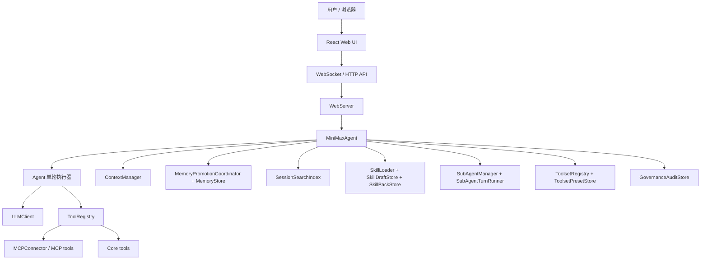
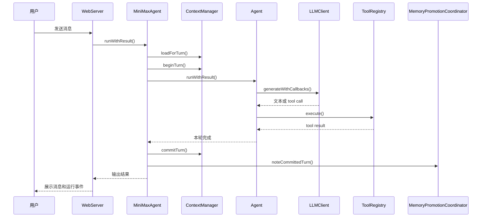

# MiniMax Agent 系统架构

## 1. 架构目标

当前系统的核心目标是：

- 本地优先
- Windows 优先
- 长会话可持续
- 工具能力可控
- 可沉淀长期 memory 和可复用 skill
- 能把单线程 Agent 运行扩展成带子代理的并行工作流

## 2. 总体分层



## 3. 主要模块职责

### 3.1 Web 层

- `src/web/server/WebServer.ts`
  负责 HTTP API、WebSocket、会话查询、配置更新、memory organize、skill 治理、toolset preset 等接口。
- `src/web/client/App.tsx`
  负责 session 切换、消息展示、流式事件、子代理面板、memory organize 状态、配置弹窗。

### 3.2 运行时编排层

- `src/index.ts` 中的 `MiniMaxAgent`
  是系统总入口，负责创建和连接所有核心服务：
  - 配置
  - LLM
  - tools
  - context
  - memory
  - skills
  - subagents
  - audit

### 3.3 单轮执行层

- `src/agent/Agent.ts`
  负责单轮对话执行循环：
  - 调用 LLM
  - 接收 tool call
  - 执行工具
  - 把结果送回模型
  - 直到本轮完成

### 3.4 上下文层

- `src/context/ContextManager.ts`
  负责上下文加载、开始 turn、记录事件、提交 turn。
- `src/context/ContextProjector.ts`
  负责把事件流投影成 `Context Snapshot`。
- `src/context/ContextEventStore.ts`
  负责事件和元数据落盘。

### 3.5 memory 层

- `src/memory/MemoryStore.ts`
  负责长期 memory 的存储、版本、替换、删除、检索。
- `src/memory/MemoryPromotionCoordinator.ts`
  负责 memory organize、批处理调度、空闲补刷、串行写入和冲突跳过。
- `src/memory/SessionSearchIndex.ts`
  负责会话历史检索索引。

### 3.6 skill 层

- `SkillLoader`
  负责 skill catalog 和正文按需加载。
- `SkillDraftStore`
  负责 draft 生成与审批。
- `SkillPackStore`
  负责 pack 版本、激活、回滚。

### 3.7 子代理层

- `SubAgentManager`
  负责子代理任务生命周期、排队、状态管理、结果写回。
- `SubAgentTurnRunner`
  负责子代理实际执行。

### 3.8 工具和能力边界层

- `ToolRegistry`
  负责已注册工具。
- `ToolsetRegistry`
  负责能力白名单。
- `ToolsetPresetStore`
  负责 team / workspace 的 preset。
- `tool-registration.ts`
  负责 capability 级别的去重和冲突处理。

## 4. 一轮对话的主链路



## 5. Context 架构

## 5.1 存储模型

当前 context 的真实来源是事件流，而不是旧的 `history_message_*.jsonl`。

主要落盘位置：

- `contexts/<scope>/<namespace>/events.jsonl`
- `contexts/<scope>/<namespace>/meta.json`

每个 turn 通过事件记录：

- `turn_started`
- `user_message`
- `assistant_message`
- `tool_call`
- `tool_result`
- `context_patch`
- `turn_summary`
- `turn_committed`

## 5.2 Prompt 里的上下文结构

当前上下文已经收敛成三层：

1. `Context Snapshot`
2. `replayMessages`
3. `compressed older-session context`

具体分工：

- `Context Snapshot`
  只放结构化状态和 namespace 元信息
- `replayMessages`
  只放最近几轮用于 prompt 连续性的对话视图；它来自 session transcript，但会做必要的 runtime 规整，不等于 session_search 使用的 raw transcript excerpt
- `compressed older-session context`
  只放更早历史的压缩摘要，并作为 session 的 runtime context state 持久化复用

也就是说：

- snapshot 不再携带 recent conversational digest
- 最近对话不再双重注入
- 真正进入后续上下文的压缩链只有 compressed older-session context 一条
- `context_manage` 查看的是当前 effective context view，而不是仅仅一份 committed projection

## 5.3 Prompt 组装契约

当前设计基线把 turn 级 prompt 分成两部分：

1. `system prompt`
2. `replayMessages + 本轮 user prompt`

其中：

- `system prompt` 负责稳定运行约束、toolset 边界、结构化 memory/todo/skill/context 快照
- `replayMessages` 负责最近几轮会话连续性视图
- 本轮 user prompt 负责当前任务和 agent/profile 选择结果

这里有两个明确边界：

- `toolset summary` 只负责说明当前 active toolset 和可调用边界，不负责展开某个具体工具的完整操作协议
- `AGENTS.md` / agent profile 正文不属于 system prompt 的长期组成部分

换句话说，agent/profile 选择属于 prompt shaping 问题，而不是 system prompt 承载问题。

## 5.4 Agent Profile 设计基线与当前偏差

设计基线：

- workspace `AGENTS.md` 默认只在 session 首轮注入一次
- 显式 `@agent` 或显式 agent 切换时，再注入新的 profile
- 未切换 agent 的后续 turn，不重复注入 profile ref 或 profile 正文
- 历史 replay 不携带 `AGENT_PROFILE_REF` 和 profile 正文
- `agentInjectionState` 应保存 active agent，并参与后续 turn 的注入判定

当前实现仍有待对齐之处：

- workspace profile 目前仍会在每次 turn 解析时重新注入 ref
- 运行时仍可能把 `AGENTS.md` 正文追加进 system prompt
- `agentInjectionState` 目前尚未成为后续注入判定的主依据

因此，阅读当前架构时需要区分：

- 设计目标：首轮/切换注入，后续复用 active agent
- 当前实现：仍存在“每轮 ref 注入”和“runtime profile 进入 system prompt”的遗留路径

## 6. memory 架构

## 6.1 基本原则

memory 负责长期可复用事实，而不是短期任务状态。

当前只有两层 memory scope：

- `user`
- `workspace`

## 6.2 organize 机制

memory 不是在每轮同步写入，而是通过后台 organize 进行。

触发条件：

- 每 3 个 committed turns 自动触发一次
- 当前 session 空闲 2 分钟自动补刷
- 用户手动点“整理记忆”

## 6.3 并发模型

同一 workspace 下可能有多个 session 同时运行，所以当前设计把所有 memory 变更统一经过串行 gate：

- 同一 workspace：串行
- 不同 workspace：可并行
- user scope：也统一走独立串行 key

这样做是为了避免：

- 重复写入
- 同 lineage 更新互相覆盖
- 多 session 并发时的竞态污染

## 6.4 分类流程

memory organize 会把未处理 turns 送去分类：

- 有 LLM 时走 Hermes 风格分类 prompt
- 没有 LLM 时退回启发式分类

分类结果：

- `discard`
- `session_only`
- `memory_candidate`

## 6.5 存储结构

主要目录：

```text
runtime/memory/
  entries/
  pending/
```

当前长期运行链主要使用 `entries/` 里的 active / superseded / expired 版本视图。  
`pending/` 目录仍保留在存储层，但已不再是主运行链的一部分。

## 7. session search 架构

session search 当前只索引 raw session transcript excerpt。

职责边界是：

- `session_search`
  负责 prior session 的 raw transcript recall
- `context_manage`
  负责当前 structured context 和 selected runtime context state
- `memory_manage`
  负责 durable memory

因此，session search 不再承担：

- 搜 compressed older-session context
- 搜 structured context state
- 搜 durable memory

## 8. skill 架构

skill 层和 memory 层分离：

- memory 讲“事实”
- skill 讲“方法”

当前 skill 仍保留治理能力：

- draft
- approve / reject
- list / view
- history
- rollback
- pack publish / activate / rollback

## 9. toolset 架构

toolset 的本质是 capability 白名单。

当前内置 toolset：

- `windows-dev`
- `research`
- `windows-safe`
- `full-access`（隐藏内部默认）

说明：

- 当前代码级默认值是 `full-access`
- 仓库内示例配置通常会显式改成 `windows-dev`
- `ToolsetRegistry` 的内置 capability 定义里仍保留了历史 `note` 项，但运行时已经没有对应的 `session_note` 工具注册；它目前属于实现残留，而不是可用用户能力

生效优先级从高到低：

1. session override
2. workspace preset
3. team preset
4. default toolset

## 10. 子代理架构

子代理是对主 Agent 的扩展执行面，不是独立产品。

职责拆分：

- `SubAgentManager`
  管理任务状态和队列
- `SubAgentTurnRunner`
  执行具体任务

更详细的子代理说明见 [SUBAGENT_ARCHITECTURE.md](./SUBAGENT_ARCHITECTURE.md)。

## 11. Web API 主要能力

当前 Web 层核心接口大致分成：

- 会话：`/api/sessions`
- 配置：`/api/config`、`/api/settings`
- toolset：`/api/toolsets`
- skill：`/api/skills`、`/api/skills/pending`、`/api/skills/packs`
- memory：`/api/memory`、`/api/memory/state`、`/api/memory/organize`
- audit：`/api/audit`
- todo：`/api/todos`
- 子代理：`/api/sessions/:id/subagents/...`

## 12. 运行数据目录

```text
contexts/                上下文事件流
runtime/audit/           治理审计
runtime/memory/          长期 memory
runtime/session-search/  会话检索索引
runtime/skills/          skill draft / history / packs
runtime/todos/           todo 数据
logs/                    日志
workspace/               默认工作目录
```

## 13. 当前架构的关键信号

如果你只记三个点：

- `Context` 是主上下文
- `memory` 是长期事实
- `skill` 是可复用方法

它们是相邻系统，不是同一个东西。
