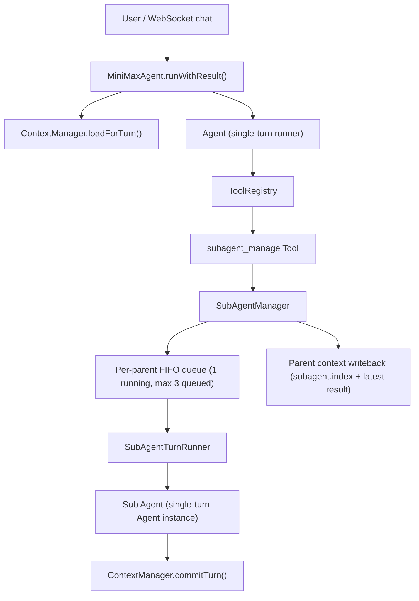

# 子代理架构补充说明

这份文档只覆盖子代理子系统。  
完整系统分层请先看 [ARCHITECTURE.md](./ARCHITECTURE.md)。

## Runtime Overview

## Class Responsibilities

- `MiniMaxAgent`: Top-level runtime coordinator. Creates core services and runs each parent turn.
- `Agent`: Single-turn dialogue executor. Does not own cross-turn history.
- `ContextManager`: Context lifecycle entry. Load snapshot, begin turn, record, commit.
- `SubAgentManageTool`: Public tool interface (`create/status/result/cancel/list/resume`).
- `SubAgentManager`: Sub-agent scheduler + lifecycle state machine + queue manager + parent writeback.
- `SubAgentTurnRunner`: Executes one queued sub-agent task using an isolated sub context.

## Naming Decisions

- Keep only one scheduler class name: `SubAgentManager`.
- Keep only one execution class name: `SubAgentTurnRunner`.
- Manager dependency field name unified to `turnRunner` (instead of generic `runner`).
- Main runtime field name unified to `subAgentTurnRunner` (instead of `subAgentRunner`).
- Tool constructor option unified to `manager` (instead of `subAgentManager`).
